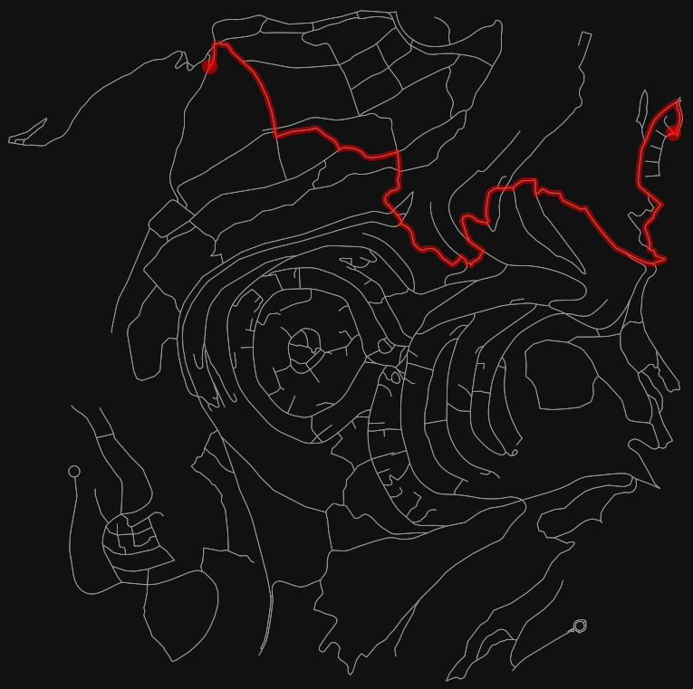

## Project Report: AI Routing on OpenStreetMap

* **Daniel Attali**
* **Sapir Bashan**

### 1. Introduction and Problem Definition

The objective of this project is to calculate the optimal route between a source address and a destination address using real-world geographic data from OpenStreetMap (OSM).  The problem is modeled as a shortest-path search on a directed graph representing the street network.

### 2. Algorithms Implemented

To solve the routing problem, three distinct algorithmic approaches were implemented and compared:

* **Search-Based Algorithm (A\*):** A deterministic, informed search algorithm utilizing the great-circle distance as an admissible heuristic.
* **Biology-Inspired Algorithm (Ant Colony Optimization - ACO):** A probabilistic algorithm simulating the pheromone-laying behavior of ants. The implementation utilizes a custom heuristic (inverse distance to goal) to guide the ants.
* **Reinforcement Learning (Q-Learning):** An episodic learning agent utilizing an epsilon-greedy policy. To mitigate sparse rewards on the massive OSM graph, reward shaping was applied to penalize loops and reward geographic progression toward the target.

### 3. Experimental Setup and Evaluation

The evaluation was conducted in two distinct phases to accurately assess both the scalability and the comparative path efficiency of the algorithms on the local OSM map (ELTA Square, Ashdod). Each algorithm was restricted to a practical computational budget (e.g., limited ants/iterations for ACO, 100 episodes for Q-Learning).

#### Phase 1: Global Random Routing (Unconstrained)

The algorithms were initially evaluated across 100 purely random source-destination pairs across the entire map.

**Table 1: Global Performance Comparison (Averaged over 100 runs)**

| Algorithm      | Avg. Path Cost (Distance)   | Avg. Execution Time (s) | Avg. Nodes Expanded | Success Rate |
|----------------|-----------------------------|-------------------------|---------------------|--------------|
| **A**\*        | 1283.98                     | 0.0009                  | 142.76              | 100%         |
| **ACO**        | $\infty$ (Did not converge) | 0.0034                  | 793.32              | 0%           |
| **Q-Learning** | $\infty$ (Did not converge) | 0.0798                  | 43223.35            | 0%           |

#### Phase 2: Localized Routing (Converged Scenarios Only)

Because the probabilistic algorithms failed to converge over vast distances within the computational budget, a second evaluation isolated 100 *converged* scenarios. This was achieved by utilizing a random-walk generator to ensure the source and destination nodes were connected and in closer proximity, allowing all three algorithms to successfully find a path.

**Table 2: Localized Performance Comparison (100 Converged Runs)**

| Algorithm      | Avg. Path Cost (Distance) | Avg. Execution Time (s) | Avg. Nodes Expanded |
|----------------|---------------------------|-------------------------|---------------------|
| **A**\*        | 238.81                    | 0.0002                  | 8.66                |
| **ACO**        | 254.57                    | 0.0053                  | 368.48              |
| **Q-Learning** | 257.04                    | 0.0203                  | 2924.42             |

*(Note: Full detailed run logs can be found in `algorithm_comparison_converged.csv` and `algorithm_comparison_results.csv`)*

### 4. Verbal Analysis of Results

The evaluation highlights a stark contrast between deterministic search and probabilistic learning models on static, real-world spatial graphs:

* **A\* Dominance:** A\* drastically outperformed the other methods in every metric across both global and local tests. By utilizing an admissible heuristic, it efficiently expanded an average of only ~143 nodes in the global test and ~9 nodes in the local test, consistently finding the mathematically optimal path in less than a millisecond.
* **Scalability Limitations (Phase 1):** Both ACO and Q-Learning struggled heavily with large state spaces. In the unconstrained global test, both algorithms consistently failed to find valid paths within the allocated computational budget, frequently returning infinite costs. The high branching factor and the presence of dead-ends (cul-de-sacs) in real urban environments trapped the exploration phases.
* **Sub-optimality in Success (Phase 2):** Even when constrained to localized, solvable proximities, the learning and biology-inspired algorithms proved highly inefficient. Q-Learning expanded roughly 337 times more nodes than A\* (2924.42 vs. 8.66) to find a path, and both ACO and Q-Learning settled for sub-optimal routes (higher average path costs of 254.57 and 257.04 compared to A\*'s true shortest path of 238.81).

### 5. Critique, Challenges, and Suggestions for Improvement

**The Challenge of State Space:** The primary challenge encountered was applying learning-based algorithms to a massive deterministic graph. While Q-learning and ACO excel in stochastic environments (e.g., dynamic traffic, changing edge weights) or constraint-satisfaction problems, they are inherently inefficient for standard static point-to-point routing compared to A\*.

**Sparse Rewards in RL:** In the initial Q-learning implementation, the agent suffered from severe sparse rewards, unable to randomly stumble upon a specific target node among thousands.  While dense reward shaping (rewarding geographic proximity) improved exploration, it often led the agent into local minima where the shortest geographic distance was blocked by a physical barrier (like a highway or missing bridge), trapping the agent.

**Suggestions for Improvement:**

1. **State-Space Abstraction:** Instead of navigating node-by-node, the graph could be simplified into major intersections or hierarchical road networks to exponentially reduce the state space for the RL agent.
2. **Hybrid Approach:** Using A\* to generate an initial baseline route corridor, and then using RL or ACO to optimize exclusively within that localized corridor for dynamic variables (like simulated traffic, weather, or dynamic safety constraints).

### 6. AI Tools Used

We used AI tools like GitHub Copilot and Google Gemini to help us understand how to use the OSMnx library. We also utilized them to write clean, readable solution algorithms, assist in debugging the reward shaping for the Q-learning agent, and to interpret, format, and summarize the final evaluation metrics for this report.

